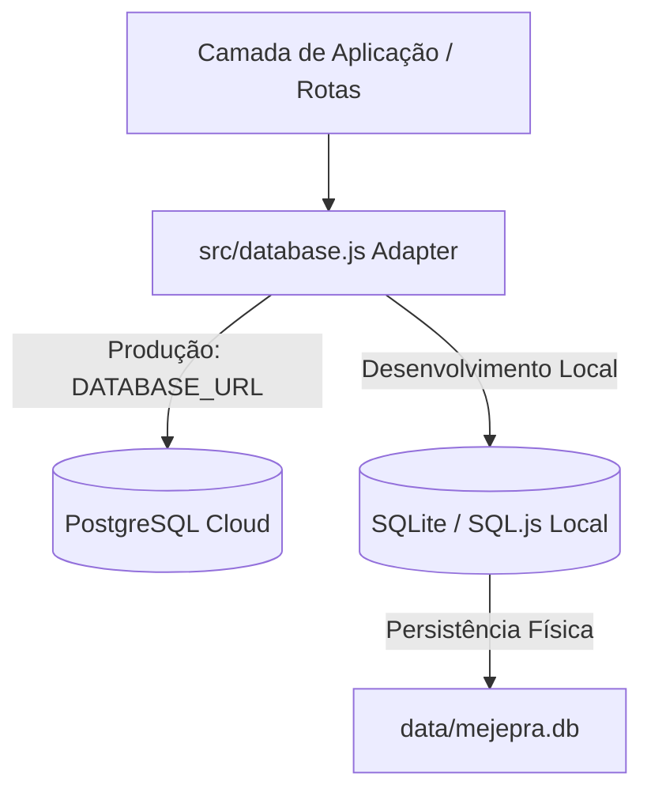

# Skill: Gestão de Banco de Dados Híbrido e Ciclo de Vida do Cache

Este diretório serve como uma **Skill de Desenvolvimento** permanente para orientar qualquer Desenvolvedor ou Agente de IA na manutenção, expansão e compreensão da camada de persistência de dados e controle de cache PWA do projeto **Mejepra**.

Sempre que precisar adicionar tabelas, alterar colunas, modificar as regras de cálculo financeiro ou resolver problemas de cache em clientes finais, leia este guia.

---

## 1. Arquitetura do Banco de Dados Híbrido (Dual-Engine)

O projeto utiliza um design de banco de dados unificado que suporta dois motores simultaneamente sem alterar as APIs de negócios.



### Regras de Ouro da Arquitetura:
1. **Dialeto Principal**: Todas as definições de tabela no objeto `SCHEMA` em `src/database.js` devem ser escritas no dialeto **PostgreSQL**.
2. **Tradução em Tempo de Execução**: Na inicialização local (SQLite), o adaptador traduz dinamicamente o dialeto Postgres para comandos equivalentes compatíveis com o SQLite usando as seguintes regras regex:
   - `SERIAL PRIMARY KEY` &rarr; `INTEGER PRIMARY KEY AUTOINCREMENT`
   - `TIMESTAMPTZ DEFAULT now()` &rarr; `TEXT DEFAULT (datetime('now'))`
   - `JSONB DEFAULT '{}'::jsonb` &rarr; `TEXT DEFAULT '{}'`
3. **Serialização Automática**: Campos estruturados (ex: objetos JSON de divisão ou status de pagamento de despesas) são serializados automaticamente em texto JSON ao escrever no SQLite e desserializados de volta em objetos JavaScript ao ler, garantindo equivalência perfeita de dados com o Postgres.

---

## 2. Padrão de Interface de Dados (Repository Pattern)

O arquivo `src/database.js` expõe uma interface assíncrona limpa. **Nunca** escreva consultas SQL diretas nas rotas. Use sempre os métodos expostos:

| Método | Assinatura | Descrição |
| :--- | :--- | :--- |
| `init()` | `async init()` | Inicializa a conexão do banco ativo e roda a criação de tabelas. |
| `getAll()` | `async getAll(table)` | Retorna todos os registros da tabela correspondente. |
| `getById()` | `async getById(table, id)` | Busca e retorna um registro por ID numérico. |
| `insert()` | `async insert(table, record)` | Insere um registro e retorna a entidade criada com timestamps. |
| `update()` | `async update(table, id, updates)` | Atualiza parcialmente uma linha e retorna o estado atualizado. |
| `delete()` | `async delete(table, id)` | Exclui uma linha do banco e retorna sucesso (booleano). |
| `query()` | `async query(table, filterFn)` | Retorna registros que atendam a uma função de filtro JS. |

---

## 3. Diretrizes para Adicionar Novas Tabelas ou Campos

Siga este passo a passo caso precise criar uma nova entidade no banco:

1. **Defina a tabela no `SCHEMA` de `src/database.js`**:
   ```javascript
   const SCHEMA = {
     // ... tabelas existentes
     nova_tabela: `
       id SERIAL PRIMARY KEY,
       medium_id INTEGER,
       descricao TEXT NOT NULL,
       detalhes JSONB DEFAULT '{}'::jsonb,
       created_at TIMESTAMPTZ DEFAULT now(),
       updated_at TIMESTAMPTZ DEFAULT now()
     `
   };
   ```
2. **Atualize as listas de tipos**:
   - Se possuir colunas JSON, adicione o nome da coluna no array `JSON_COLUMNS`.
   - Se possuir inteiros ou decimais, adicione em `INTEGER_COLUMNS` ou `FLOAT_COLUMNS` para garantir a conversão correta no SQLite.
3. **Escreva Migrações Seguras (Try/Catch)**:
   Se precisar adicionar colunas a tabelas existentes, crie uma função de migração dedicada dentro do `initSQLite` protegida por `try/catch` para evitar falhas em bancos que já possuam a coluna:
   ```javascript
   try {
     db.run("ALTER TABLE nova_tabela ADD COLUMN novo_campo TEXT DEFAULT ''");
   } catch(e) {}
   ```

---

## 4. Vacina contra Cache PWA (Client-Side Updates)

O projeto é um Progressive Web App (PWA) e cacheia agressivamente as telas HTML, JS e CSS no navegador do cliente para carregamento offline rápido. 

Para forçar a atualização das telas no cliente sem exigir "hard-reset", você deve seguir esta rotina a cada deploy:

1. **Atualize o nome do cache no `service-worker.js`**:
   ```javascript
   // Incremente a versão a cada deploy (ex: v3 -> v4)
   const CACHE_NAME = 'mejepra-v4';
   ```
2. **Garantia de Auto-Reload**:
   Cada arquivo HTML da interface possui um listener que monitora a troca do Service Worker ativo. Quando a nova versão é instalada em segundo plano, ela dispara o evento e o navegador recarrega a página de forma silenciosa e invisível para o usuário final:
   ```javascript
   if('serviceWorker' in navigator){
     navigator.serviceWorker.register('/service-worker.js').catch(()=>{});
     let refreshing = false;
     navigator.serviceWorker.addEventListener('controllerchange', () => {
       if (!refreshing) {
         refreshing = true;
         window.location.reload();
       }
     });
   }
   ```

---

## 5. Rotinas de Manutenção e Recuperação

- **Backup**: Utilize a rota `GET /api/backup` para obter um payload JSON completo contendo os dados do banco físico.
- **Restauração**: Faça um envio `POST /api/restore` com o payload JSON para substituir os dados locais de desenvolvimento ou povoar o Postgres de produção no Railway após re-deploys.
